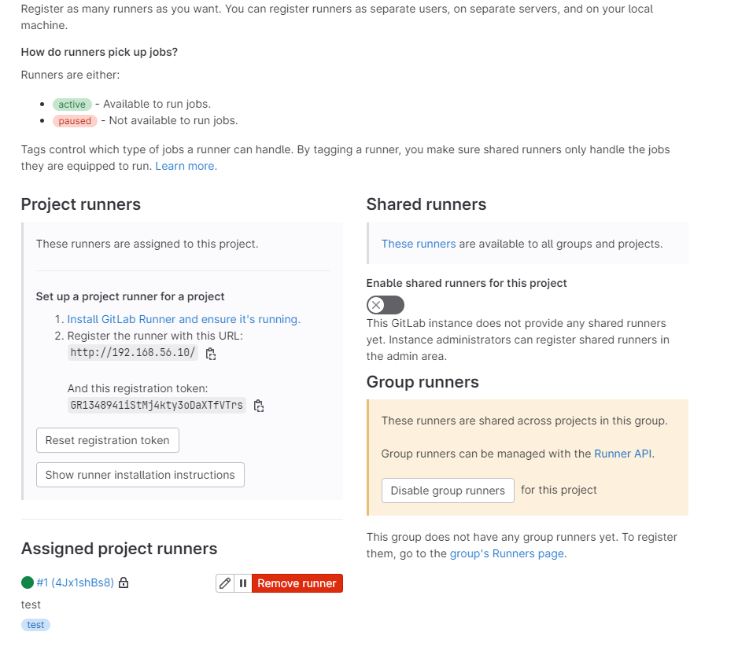
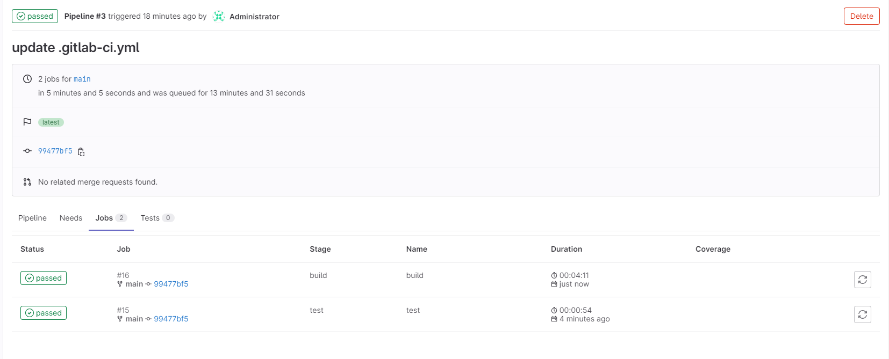
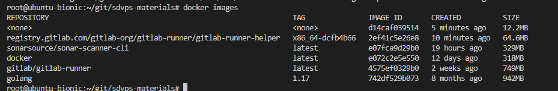

# Домашнее задание к занятию "`8-03-Gitlab`" - `Шадрин Алексей`

### Задание 1

Разверните GitLab локально, используя Vagrantfile и инструкцию, описанные в этом репозитории.
Создайте новый проект и пустой репозиторий в нём.
Зарегистрируйте gitlab-runner для этого проекта и запустите его в режиме Docker. Раннер можно регистрировать и запускать на той же виртуальной машине, на которой запущен GitLab.
В качестве ответа в репозиторий шаблона с решением добавьте скриншоты с настройками раннера в проекте.



### Задание 2

Что нужно сделать:

Запушьте репозиторий на GitLab, изменив origin. Это изучалось на занятии по Git.
Создайте .gitlab-ci.yml, описав в нём все необходимые, на ваш взгляд, этапы.
В качестве ответа в шаблон с решением добавьте:

файл gitlab-ci.yml для своего проекта или вставьте код в соответствующее поле в шаблоне;
скриншоты с успешно собранными сборками.
````yaml
stages:
  - test
  - build

test:
  stage: test
  image: golang:1.17
  script: 
   - go test .

build:
  stage: build
  image: docker:latest
  script:
   - docker build .
````



